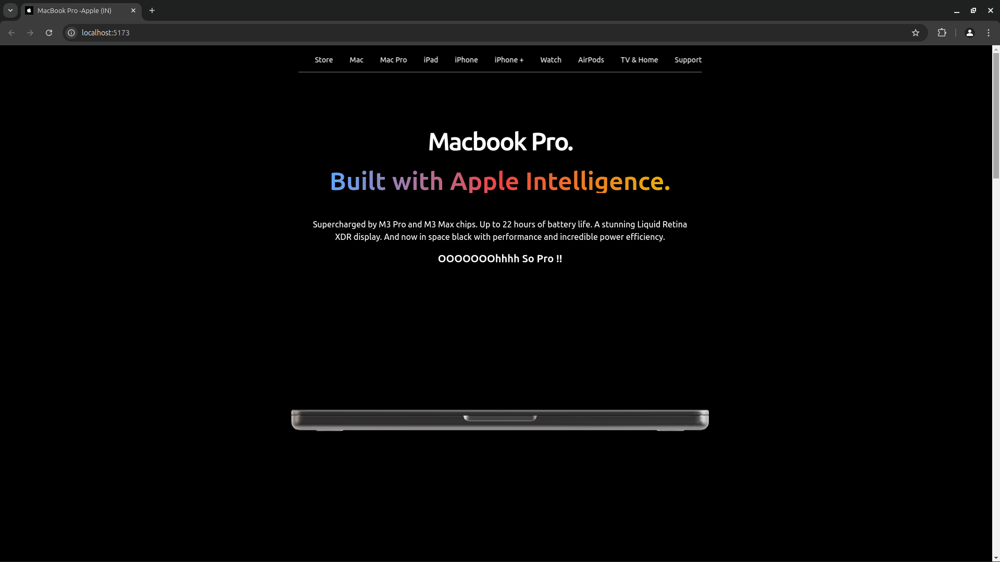
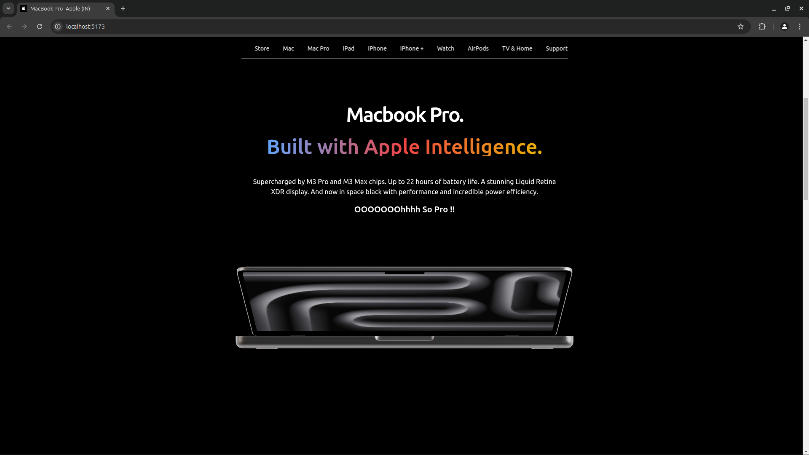
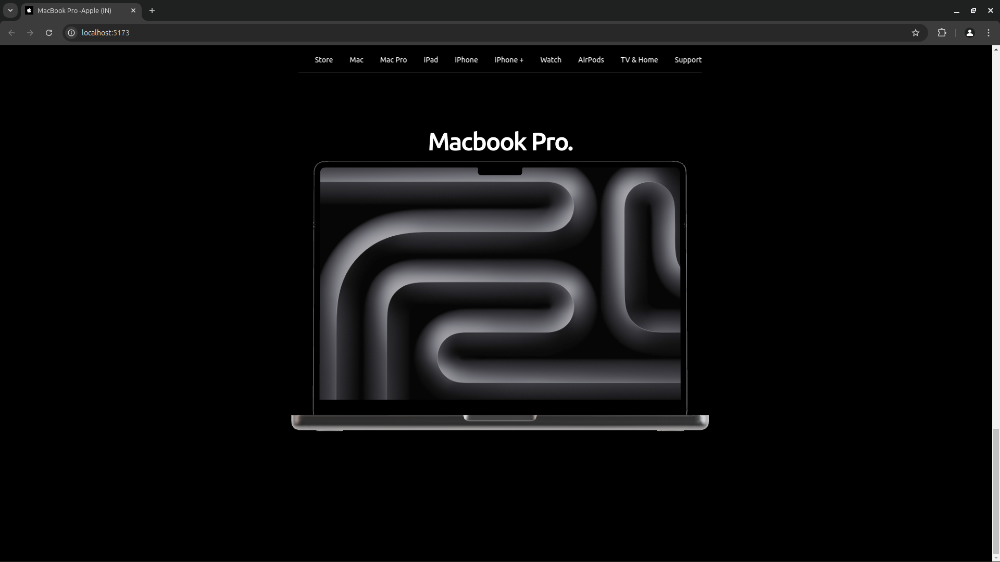
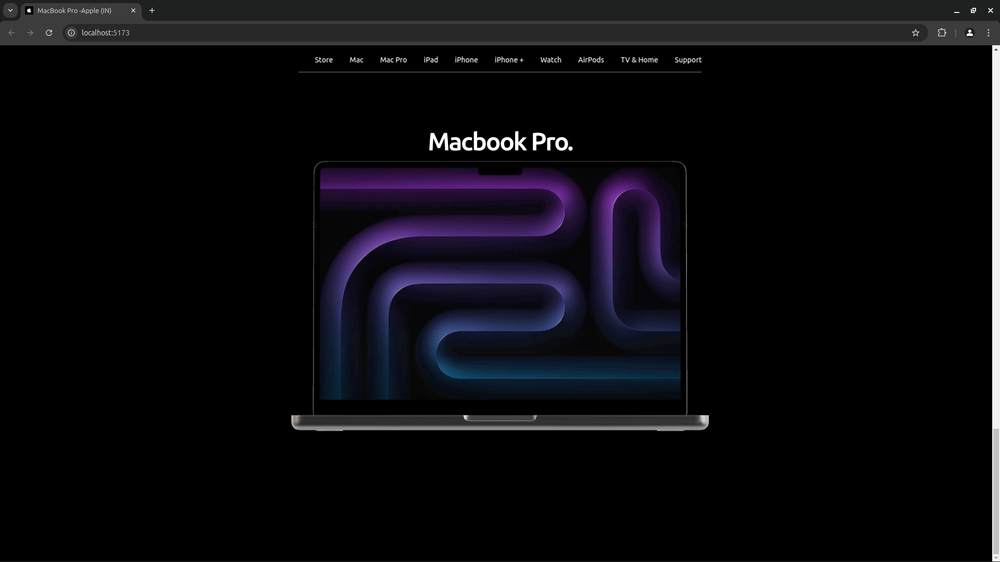

## Apple MacBook Pro Landing Page 💻 🚀

A visually stunning landing page for the Apple MacBook Pro, showcasing the power of M3 Pro and M3 Max chips through an interactive 3D experience.

### 🌟 Features
- **Interactive 3D Model**: Seamlessly explore a 3D-rendered MacBook Pro using @react-three/fiber and @react-three/drei.
- **Scroll Animation**: Dynamic model rotation and animation triggered by user scrolling, offering an immersive experience.
- **Apple-Inspired Design**: A sleek and modern design inspired by Apple's signature aesthetic.
- **Realistic Textures**: High-quality textures and environment mapping create a lifelike rendering of the MacBook Pro.

### 🛠️ Technologies Used
- **React**: For building the user interface and components.
- **Three.js**: To power the high-performance 3D rendering.
- **@react-three/fiber**: React's renderer for Three.js, simplifying 3D development.
- **@react-three/drei**: A collection of helper utilities for Three.js and React.
- **GLTF Models**: Used for the MacBook Pro 3D asset.
- **Tailwind**: Utility-first CSS framework for styling and responsiveness.

### 🚀 How to Run

1. Clone the repository:
   ```bash
   git clone https://github.com/atishaytuli07/MacbookPro.git
   ```

2. Navigate to the project directory:
   ```bash
   cd MACBOOK
   ```

3. Install dependencies:
   ```bash
   npm install
   ```

4. Start the development server:
   ```bash
   npm start
   ```

5. Open your browser and visit `http://localhost:3000` to view the landing page.


### 🎥 Demo





### 🤝 Contributions

Contributions are welcome! thank you, Happy Coding !!
